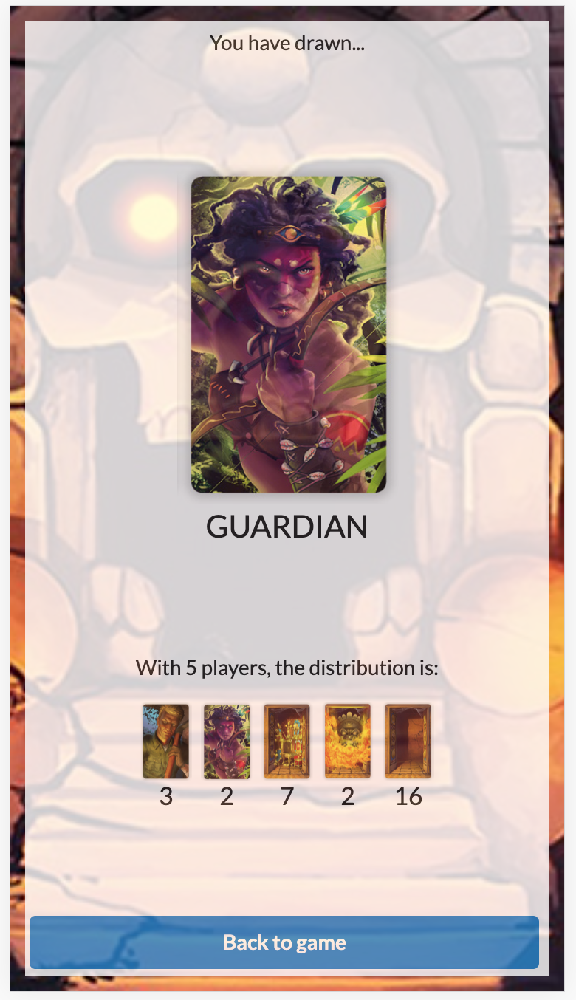

# Tempel des Schreckens

<div style="display: flex; justify-content: space-around;">
  
  
  
  
</div>

## Introduction

[**Tempel des Schreckens**](https://tempel.rcr.dev/) *(English: 'Temple of Terrors')* is a quick-play party game that combines cooperative social deduction with bluffing, luck and chance.

It is for **3-10 players**, and games take **as little as 10 minutes**.

**Tech Stack:**
- **Frontend**: React 17 + TypeScript, Socket.io client, Semantic UI
- **Backend**: Node.js + TypeScript, Express, Socket.io server
- **Deployment**: Docker, Heroku, CapRover ready

## About This Repository

This repository is based on the original [tempel-des-schreckens](https://github.com/richardcrng/tempel-des-schreckens) by [richardcrng](https://github.com/richardcrng), with additional build configurations and setup instructions to easily **host the game locally** for friends and family.

**Key additions:**
- ✅ **Docker Compose setup** for one-command deployment
- ✅ **Local network hosting** instructions  
- ✅ **Comprehensive installation guides** for all skill levels
- ✅ **Mobile-friendly local hosting**
- ✅ **Troubleshooting documentation**

Perfect for hosting private game sessions, LAN parties, or when you want to run your own instance!

## Quick Start

### Option 1: Docker Deployment (Recommended for Local Hosting)
```bash
# Clone this repository
git clone https://github.com/RobinSchmid7/temple_game
cd temple_game

# Start with Docker Compose
docker-compose up --build

# Access at http://localhost:8080
# Others can join at http://[your-ip]:8080
```

### Option 2: Development Setup
```bash
# Install Node.js 16.x (using nvm)
nvm install 16 && nvm use 16

# Install dependencies
yarn install

# Start development servers (2 terminals)
yarn dev:server    # Terminal 1 (backend on :8080)
yarn dev:client    # Terminal 2 (frontend on :3000)
```

## Installation & Setup

### Prerequisites

- **For Docker**: Docker Desktop
- **For Development**: Node.js 16.x, Yarn

### Local Development Setup

1. **Install Node.js 16.x**:
   ```bash
   # Install nvm (if not already installed)
   curl -o- https://raw.githubusercontent.com/nvm-sh/nvm/v0.39.0/install.sh | bash
   
   # Restart terminal, then:
   nvm install 16
   nvm use 16
   ```

2. **Install Dependencies**:
   ```bash
   yarn install
   ```

3. **Start Development Servers**:
   ```bash
   # Terminal 1 - Backend
   yarn dev:server
   
   # Terminal 2 - Frontend  
   yarn dev:client
   ```

4. **Access the Game**:
   - **Your computer**: http://localhost:3000
   - **Others on network**: http://[your-ip]:3000

### Docker Deployment

**Prerequisites**: Docker Desktop installed and running

1. **Single Container Deployment**:
   ```bash
   # Build and run
   docker-compose up --build
   
   # Or run in background
   docker-compose up --build -d
   
   # Access at http://localhost:8080
   ```

2. **Manual Docker Build**:
   ```bash
   # Build the image
   docker build -f server.Dockerfile -t tempel-game .
   
   # Run the container
   docker run -p 8080:8080 tempel-game
   ```

3. **Production Build (without Docker)**:
   ```bash
   yarn build
   yarn start:server:compiled
   # Access at http://localhost:8080
   ```

### Local Network Play

To host a game for friends on the same WiFi network:

1. **Start the server** (using any method above)

2. **Find your IP address**:
   ```bash
   # Mac/Linux
   ifconfig | grep "inet " | grep -v 127.0.0.1
   
   # Windows
   ipconfig | findstr "IPv4"
   ```

3. **Share the URL**: Give everyone `http://[your-ip]:8080` (Docker) or `http://[your-ip]:3000` (development)

4. **Create a game** and share the game code with others

### Mobile Support

The game works perfectly on mobile browsers:
- **iOS**: Safari, Chrome, Firefox
- **Android**: Chrome, Firefox, Samsung Browser
- **Responsive design** adapts to all screen sizes
- **Touch-friendly** interface for card selection

## Available Commands

### Development
```bash
yarn dev:client          # Start React dev server (port 3000)
yarn dev:server          # Start Node.js dev server (port 8080)
yarn build               # Build both client and server for production
yarn start:server:compiled  # Run production build
```

### Code Quality
```bash
yarn lint                # Run ESLint on all workspaces
yarn lint:strict         # Run ESLint with zero warnings
yarn format              # Format code with Prettier
yarn format:check        # Check code formatting
yarn test                # Run all tests
yarn typecheck           # Run TypeScript type checking
```

### Docker
```bash
docker-compose up --build    # Build and start containers
docker-compose down          # Stop containers
docker-compose logs -f       # View logs
docker-compose ps           # Check container status
```

## Game Context

The game is best played with the [official physical card set](https://www.spiel-des-jahres.de/en/games/tempel-des-schreckens/).

If you can't play with a physical set - e.g. for remote play on group video calls - you can use this web app implementation, which uses identical rules.

## Troubleshooting

### Node.js Version Issues
If you get engine compatibility errors:
```bash
# Use Node 16
nvm install 16 && nvm use 16
yarn install
```

### Docker Issues
- **"Cannot connect to Docker daemon"**: Start Docker Desktop
- **Build failures**: Try `docker system prune -f` then rebuild
- **Port conflicts**: Make sure ports 8080/3000 aren't in use

### Network Issues
- **Can't connect from phones**: Ensure all devices on same WiFi
- **Firewall blocking**: Temporarily disable firewall or allow Node.js connections
- **Wrong IP**: Use `hostname -I` or check router admin panel

### TypeScript Build Errors
If you encounter lodash type errors during Docker build, update `server/tsconfig.json`:
```json
{
  "compilerOptions": {
    // ... existing options ...
    "strict": false,
    "skipLibCheck": true
  }
}
```

## Guide to Playing

- [Game rules](RULES.md)
- [Basic strategy](STRATEGY.md)

## Deployment Options

This repository is configured for deployment on:
- **Heroku**: Uses `Procfile`
- **CapRover**: Uses `captain-definition` and `server.Dockerfile`
- **Docker**: Uses `docker-compose.yml`
- **Manual**: Standard Node.js deployment

## Credits

Original game and implementation by [richardcrng](https://github.com/richardcrng) at [tempel-des-schreckens](https://github.com/richardcrng/tempel-des-schreckens).

This repository adds local hosting capabilities and deployment improvements for easier self-hosting.

## Contributing

1. Fork the repository
2. Create a feature branch
3. Make changes and test locally
4. Run `yarn lint` and `yarn format`
5. Submit a pull request

## License

This project implements the rules of Tempel des Schreckens. The original game is by [Spiel des Jahres](https://www.spiel-des-jahres.de/en/games/tempel-des-schreckens/).